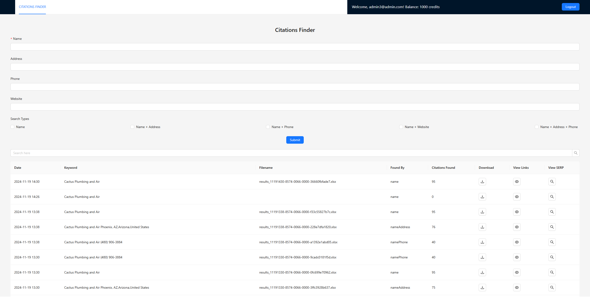

## Citation Finder

Citation Finder is a web application that allows users to search for citations, manage tasks, and download citation results. This project uses a React frontend, an Express.js backend, PostgreSQL for database management, and integrates with external APIs for data processing.

## Features

User authentication and authorization
Citation search by various parameters
Task management and tracking
File downloads with secure authentication
Integration with Google Places and DataForSEO APIs

## Installation

* Clone the repository:
`git clone https://github.com/HaidaDaniel/citation-tool.git`

* Add environment variables to .env file as in `.env.example`

* Start the application using Docker:
`docker-compose up -d`

* Access the web application:
webserver url: `http://localhost:8080/`

## Environment Variables

- DATABASE_URL=postgresql://admin:admin@db:5432/citation_db
- GOOGLE_PLACES_API_KEY=your_google_places_api_key
- DATAFORSEO_EMAIL=your_dataforseo_email
- DATAFORSEO_PASSWORD=your_dataforseo_password
- SERVER_URL=http://localhost:3001